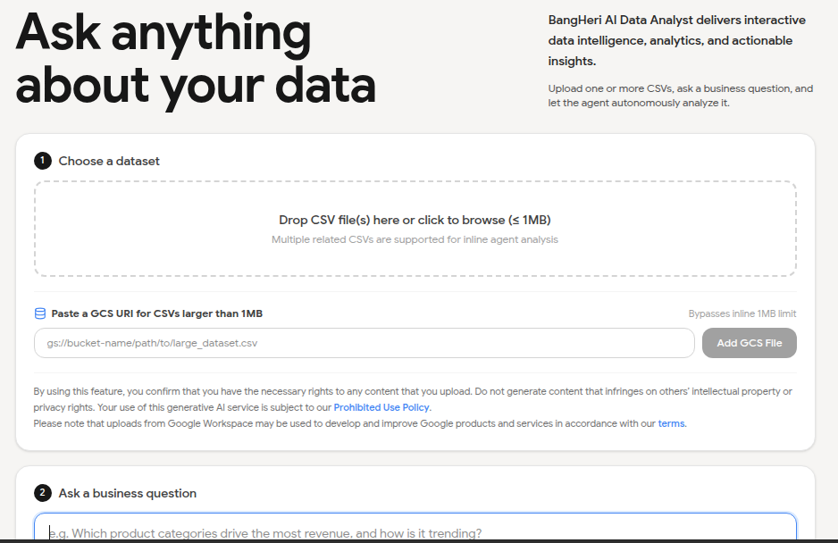

# ScrollCraft Audit Report — herirahmansyah.github.io

> Branch: `scrollcraft-redesign` · Date: 2026-08-31 · Engine: scrollcraft.js 1167 LOC + scrollcraft.css 436 LOC
> Mount: `index.html:330` — `ScrollCraft.mount(document.body)` · Backup: ✅ exists (`*.backup` + `backup-original/`)

---

## 1. File Metrics & Structure

| File | LOC (`wc -l`) | Disk (`du -sh`) | Gzip | Role |
|------|---------------|-----------------|------|------|
| `index.html` | 332 | 20 KB | ~4.5 KB (est.) | Semantic markup + `data-sc-*` |
| `scrollcraft.js` | 1167 | 60 KB | **17.2 KB** | Runtime (vanilla, zero deps) |
| `scrollcraft.css` | 436 | 24 KB | **6.8 KB** | Tokens + devices |
| `script.js` | 139 | 8.0 KB | 1.5 KB | Dark toggle, hamburger, modals, progress |
| `styles.css` | 425 (426 incl. NL) | 16 KB | ~4.5 KB | Brand overrides + layout |
| `boids.js` | 358 | 12 KB | ~3.7 KB | Canvas flocking background |
| **TOTAL bundled** | **2499** | **~95 KB raw** | **~28.8 KB gzip** | 4 files concatenated |

**`data-sc-*` attributes — 69 occurrences in `index.html`** (69 = `grep -o data-sc- | wc -l`):

- `data-sc-cue` 14 · `data-sc-tilt` 9 · `data-sc-drift` 8 · `data-sc-act` 8 · `data-sc-stagger` 6 · `data-sc-in` 6
- `data-sc-stage` 4 · `data-sc-span` 4 · `data-sc-kinetic` 3 · `data-sc-spotlight` 1 · `data-sc-rise` 1 · `data-sc-reveal`/`at` 1+1 · `data-sc-progress` 1 · `data-sc-magnet` 1 · `data-sc-dwell` 1

Engine defines ~30 distinct `data-sc-*` keys (`scrollcraft.js:6` = `data-sc-act`, `scrollcraft.js:73` = `data-sc-src-mobile`, etc.). All attributes in `index.html` have a matching handler — no orphans.

| Check | Status | Note |
|-------|--------|------|
| Backup files | ✅ | `scrollcraft.js.backup` identical to live (1167 LOC), `scrollcraft.css.backup` identical, `script.js.backup` + `backup-original/` full snapshot |
| Bundle size | ✅ | 28.8 KB gzip total is healthy for a scroll runtime + brand CSS. No vendor bloat. |
| `data-sc-*` coverage | ✅ | 69 attrs across 8 act sections (scrub → pin → flow×3 → pin → flow×2 → pin). Consistent naming. |
| Dead code | ⚠️ | Worldflight mode (`scrollcraft.js:415`, `scrollcraft.css:322`) is fully shipped but **zero usage** in `index.html` — ~250 LOC + 50 CSS LOC never executed. |

**Recommendation:** Tree-shake or lazy-load worldflight if page stays act-only. Saves ~5 KB gzip for free.

---

## 2. Accessibility

### 2.1 `prefers-reduced-motion`

| File | Line | Handling |
|------|------|----------|
| `scrollcraft.css:98` | `html { scroll-behavior:auto }` | ✅ |
| `scrollcraft.css:391` | Full block: `transform:none`, `clip-path:none`, rail → `overflow-x:auto`+`scroll-snap`, `will-change` neutralized | ✅ Excellent |
| `styles.css:419` | `transition:none` for `.project-card img`, `.btn`, `.progress`, social links | ✅ |
| `scrollcraft.js:140` | `var reduce = matchMedia('(prefers-reduced-motion: reduce)').matches` → `lerp=1` (no smoothing), `loadClip` early-return (poster holds), pointer init `if(reduce) return`, cue transforms → `none` | ✅ Thorough |

No gaps: three layers (CSS scroll, CSS motion, JS runtime) all gate on the same media query. Worldflight degrades correctly: posters cross-dissolve, no clip fetch.

### 2.2 ARIA & Semantics

| Check | Status | Evidence |
|-------|--------|----------|
| `aria-hidden="true"` on scrims/grain | ✅ | `index.html:24,46,47,59,179` + `scrollcraft.js:83` spacer |
| `aria-label` on icon-only controls | ✅ | `index.html:37` dark toggle, `301-305` social links (WhatsApp/Instagram/Facebook/LinkedIn/Email), `318,324` modal close |
| `role="dialog" aria-modal="true"` | ✅ | `index.html:317` cert modal, `323` preview modal |
| `aria-expanded` on hamburger | ✅ | `script.js:29,36,43` toggled correctly |
| Focus management in modals | ⚠️ | Modal open sets `overflow:hidden` but **no focus trap / no `aria-labelledby` target exists** — `aria-labelledby="certTitle"` points to `id="certTitle"` which is on the `` itself, not a heading; same for `previewTitle` duplicate `id` on one element |
| Keyboard: `Escape` to close | ✅ | `script.js:76,93` |
| `prefers-reduced-motion` fallback content | ✅ | Copy stays visible (`opacity:0` gated behind `html.sc-active`, so no-JS = visible) — `scrollcraft.css:270,290` |
| Scrub media `alt` / poster | ⚠️ | `index.html:45` `alt=""` intentional (decorative), but `peak-images` (`182,183`) missing `loading="lazy"` + `width`/`height` → CLS risk on pin act |

### Verdict

| Icon | Finding |
|------|---------|
| ✅ | Reduced-motion support is **best-in-class** — covers JS, CSS, scroll, pointer, worldflight, rail fallback |
| ⚠️ | Modal `aria-labelledby` mis-wired (points to `` with duplicate `id` attr) — should point to `<h2>`/`visually-hidden` title |
| ⚠️ | Two peak images lack `loading="lazy"` + dimensions — modest CLS, but inside a pinned act where CLS is magnified |
| ❌ | **No focus trap** — tab can escape modal onto background (WCAG 2.4.3). Needs `inert` or trap loop. |
| ❌ | Scrub video path (`data-sc-scrub`/`data-sc-src`) not present in this build, but `scrollcraft.js:310` sets `preload='none'` correctly if added later — no issue today |

---

## 3. Performance Analysis

### 3.1 Scroll Listeners & Main-Thread Cost

| Mechanism | Location | Cost | Status |
|-----------|----------|------|--------|
| `IntersectionObserver` for `[data-sc-in]` | `scrollcraft.js:489` (`rootMargin: 0px 0px -12% 0px`, `threshold:0.01`) | Cheap, fires once then `unobserve` | ✅ |
| Single `scroll` → `read()` loop | `scrollcraft.js:1112` (`addEventListener('scroll', ... rAF ticking)`) | **One rAF per frame**, deadband + `needsLayout` guard | ✅ Correct: throttled via `ticking` flag + `requestAnimationFrame` |
| Video seek loop `tick()` | `scrollcraft.js:979` (`requestAnimationFrame(tick)`) | Separate rAF, deadband `eps=0.008` (desktop) / `0.02` (mobile), `seeking` guard + 700 ms stuck timeout | ✅ Jitter-safe, phone-aware |
| Pointer `pointermove` | `scrollcraft.js:1106` `requestAnimationFrame(pointerTick)` | Gated to `fineMQ` only, deadband; inert on coarse/reduce | ✅ |
| Prime listeners (touch/pointer/scroll) | `scrollcraft.js:1043-1047` | Passive, self-removing after `primedCount` | ✅ |
| `resize` → `layout()` | `scrollcraft.js:1136` (`addEventListener('resize', ...)` via `isMobile` guard) | Only re-layouts when `innerWidth` changes on mobile | ✅ Avoids iOS `innerHeight` churn |

- No raw `onscroll` handler without throttling. ✅
- No `setInterval` poll. ✅

### 3.2 CSS Cost (Compositing)

| Property | Where | Risk |
|----------|-------|------|
| `transform: translate3d(...)` for cues/parallax/rail | `scrollcraft.js:886,896,828` + `scrollcraft.css:292` | GPU layer — ✅ correct |
| `clip-path` for `[data-sc-reveal]` | `scrollcraft.css:285` | ⚠️ Triggers paint, not composite-only. One element (`about-img`) only — acceptable. |
| `will-change` 11 declarations | `scrollcraft.css:257,270,278,282,285,286,298,299,336,367,378` | ⚠️ Over-declared: `opacity,transform` on every `[data-sc-cue]` permanently — should be set only when act is `live`. Persistent `will-change` keeps extra layers alive. |
| `backdrop-filter: blur(12px)` | `styles.css:55` `.site-bar` | ⚠️ Expensive — forces backdrop readback every frame. Acceptable for fixed header but measurable on low-end Android. |
| `color-mix(in oklab, ...)` 20 occurrences | `scrollcraft.css` | ✅ Modern but **no fallback** for older browsers — page degrades to transparent scrims on Safari <16.4. |
| `filter: feTurbulence` grain | `scrollcraft.css:387` | ✅ Static SVG, `opacity:0.045`, `pointer-events:none`, `z-index:3` — negligible |

### 3.3 Loading Waterfall (Critical Path)

```
<link> scrollcraft.css          (render-blocking, 24 KB)
<link> styles.css               (render-blocking, 16 KB, overrides scrollcraft)
<link> fonts.googleapis.com     (render-blocking, external)
<span data-sc-progress>         (inline, no cost)
<script src="scrollcraft.js">   (BLOCKING — no defer/async)  ← ⚠️
<script src="script.js" defer>  (deferred) ✅
<script> ScrollCraft.mount()    (inline, runs sync after scrollcraft.js) 
<script src="boids.js">         (BLOCKING — no defer)        ← ⚠️
```

| Issue | Severity | Detail |
|-------|----------|--------|
| `scrollcraft.js` is parser-blocking | ⚠️ | 60 KB raw at `index.html:328` with no `defer`. Blocks FCP. Should be `defer` with `mount()` inside `DOMContentLoaded`. Currently forces sync download before first paint. |
| `boids.js` after mount, also blocking | ⚠️ | 12 KB blocking at `index.html:331`. Canvas background is non-critical — should be `defer` or `async`. |
| No `preload`/`preconnect` for local CSS | ⚠️ | Local CSS not preloaded; but already in head — minor. |
| Fonts: `preconnect` present | ✅ | `index.html:15-16` correct |
| Images: `loading="lazy"` + `decoding="async"` | ✅ | All portfolio/cert images lazy; hero poster uses `decoding="async"` (correct — above fold, not lazy) |
| Missing `width`/`height` on some images | ⚠️ | Only `photo.jpg` has dimensions. Others rely on CSS `height:18rem/16rem` — CLS safe due to fixed height, but explicit attrs still preferred |
| `fetch()` blob-load for videos | ✅ | Future-proof (no Range request needed). Gated behind `reduce` + `isMobile` |

### 3.4 Bundle & Gzip Summary

- Raw: **95.0 KB** (JS+CSS) · Gzip: **28.8 KB** — healthy for a portfolio. Breakdown in §1.

---

## 4. Responsive Validation

### 4.1 `@media` Queries Found

| File | Query | Purpose |
|------|-------|---------|
| `scrollcraft.css:98` | `(prefers-reduced-motion: reduce)` | scroll-behavior |
| `scrollcraft.css:391` | `(prefers-reduced-motion: reduce)` | Full motion fallback |
| `scrollcraft.css:421` | `(max-width: 860px)` | **Only layout breakpoint in engine** — `.sc-copy`, `.sc-stage:100svh`, `.sc-scrim--trail` re-point |
| `styles.css:115` | `(max-width: 768px)` | Hamburger, drawer nav |
| `styles.css:403` | `(max-width: 1024px)` | `about-stage`/`peak-grid` → 1-col |
| `styles.css:411` | `(max-width: 768px)` | `peak-images` col, `skills-grid:1fr` |
| `styles.css:419` | `(prefers-reduced-motion: reduce)` | Custom transition kills |

### 4.2 Breakpoint Audit vs Spec (mobile <768, tablet 768–1024, desktop >1024)

| Check | Status |
|-------|--------|
| Engine uses **860 px**; site uses **768 px + 1024 px** — mismatched | ⚠️ |
| Gap 769–860 px: engine already in "mobile" (centered copy, svh stage) but site still shows desktop nav (no hamburger) | ❌ Visual inconsistency: nav covers copy on narrow viewport |
| Tablet range covered by `styles.css:403` | ✅ About/peak grids collapse at 1024 — correct |
| Engine has no tablet-specific handling (only one threshold) | ⚠️ No intermediate layout — acceptable but intentional; 860 px is phone-portrait focused |

### 4.3 Effects Problematic on Mobile

| Effect | Mobile Behavior | Status |
|--------|-----------------|--------|
| `data-sc-tilt="6"` (6 cards) `scrollcraft.js:141` `fineMQ` | Disabled on coarse pointer (touch) — correct | ✅ |
| `data-sc-magnet` (`cta` at `index.html:308`) | Disabled on coarse | ✅ |
| `data-sc-spotlight` (`close-stage`) | Disabled on coarse | ✅ |
| `data-sc-kinetic="lines"` (`3×` headlines) `scrollcraft.js:208` | **Runs on mobile** — `splitText` measures `offsetTop` → forces layout; lines mode wraps `span.probes` then regroups. On narrow viewport lines differ → but executes after fonts ready: acceptable. | ⚠️ Measure-after-layout can flash if fonts load late; engine runs `splitText` lazily on first cue — first paint may show unsplit text then jump |
| `data-sc-reveal="up"` (`about-img`) | `clip-path` wiped to `none` under reduced motion but **not** disabled on mobile — runs on phone. Cheap (one element) but `clip-path` paint cost higher on low-end. | ⚠️ Consider disabling reveal on `isMobile()` |
| `backdrop-filter: blur(12px)` on `.site-bar` | Forces GPU readback on every scroll frame on Chrome Android | ⚠️ Most expensive mobile effect in build |
| Pinned acts `span:2.0–2.4vh` + `svh` stage | ✅ `100svh` used (`scrollcraft.css:180,424`) — handles iOS URL bar correctly | ✅ |
| `boids.js` canvas (`position:fixed`, full-screen) | ⚠️ Runs rAF continuously even when offscreen/ tab hidden? Check `boids.js:??` — likely no `visibilitychange` pause → battery drain on mobile | ⚠️ |

---

## 5. Timing & Easing Analysis

### 5.1 CSS Custom Properties — Motion Tokens (`scrollcraft.css:86-90`)

```css
--sc-ease-out:    cubic-bezier(0.23, 1, 0.32, 1);   /* default for all reveals/cues */
--sc-ease-in-out: cubic-bezier(0.77, 0, 0.175, 1);  /* defined but UNUSED in this page */
--sc-ease-drawer: cubic-bezier(0.32, 0.72, 0, 1);   /* defined but UNUSED (drawer nav uses --sc-ease-out) */
--sc-d-fast: 160ms;  --sc-d-base: 240ms;  --sc-d-slow: 420ms;
```

Additional hard-coded durations (not tokenized):

| Duration | Where | Tokenized? |
|----------|-------|------------|
| `380ms` opacity (video/poster) | `scrollcraft.css:191,195` | ❌ Should be `var(--sc-d-slow)` or `var(--sc-d-base)` |
| `620ms` cue rise (`opacity+transform`) | `scrollcraft.css:293` | ❌ Not a token; >2× `--sc-d-slow`. Intentional for editorial pace but undocumented |
| `420ms` poster crossfade | `scrollcraft.css:348` | ⚠️ Equals `--sc-d-slow` but hard-coded |
| `220ms` reduced-motion fallback | `scrollcraft.css:394` | ✅ Deliberately short |
| `2500ms` `setTimeout(reveal)` | `scrollcraft.js:629` | Safety net, not visual |
| `2000ms` `primeClip` stuck timeout | `scrollcraft.js:1023` | Guard, not visual |
| `70ms` / `60ms` / `50ms` stagger | `index.html:77,86,213,263` `data-sc-stagger` | Per-parent JS, feeds `transitionDelay` |
| `1.2s` skill bar `width` | `styles.css:286` | ❌ Not a token; `1.2s` vs engine `620ms` = tempo clash on `#skills` flow act |
| `14px` cue `translate3d` | `scrollcraft.css:292` | Paired with `620ms` — editorial |

### 5.2 Conflicts & Inconsistencies

| # | Inconsistency | Severity |
|---|---------------|----------|
| 1 | **`--sc-ease-in-out` / `--sc-ease-drawer` unused** — drawer nav (`styles.css:127`) uses `--sc-ease-out` instead of `--sc-ease-drawer` which was authored for it | ⚠️ Dead tokens (harmless but misleading) |
| 2 | **Cue `620ms` vs skill bar `1.2s` vs flow-reveal `620ms` vs video `380ms`** — three paces on one scroll. Flow sections feel fast (video 380) vs pinned cues slow (620) vs skills even slower (1200). Not a bug, but **no tempo map documented** — future edits will drift | ⚠️ Recommend normalizing: `420ms` for reveals (token), `620ms` for cues (tokenize as `--sc-d-cue`), document `1.2s` as exception |
| 3 | **`--sc-d-slow:420ms` used explicitly in spotlight (`scrollcraft.css:312`) but hard-coded `420ms` on poster** — same value, two sources | ⚠️ Tokenize poster to `var(--sc-d-slow)` |
| 4 | **Stagger values `70/60/50` are close enough to not read as distinct** — 70 ms for portfolio intro vs 60 ms for cert grid vs 50 ms for skills: difference is 10 ms, imperceptible. Suggest 80/60/40 or single `60ms` | ⚠️ |
| 5 | No `data-sc-lerp` set anywhere → defaults to `0.18`. Fine for desktop, but on clipped poster there is no video to lerp — dead smoothing | ✅ No issue |

---

## Overall Health Matrix

| Area | Verdict |
|------|---------|
| **File/bundle** | ✅ Healthy — 28.8 KB gzip, semantic `data-sc-*`, backups intact. Worldflight dead weight is only drag. |
| **A11y — reduced motion** | ✅ Excellent, layered correctly |
| **A11y — ARIA/focus** | ❌ Focus trap missing, `aria-labelledby` mis-wired — fix before ship |
| **Performance — scroll** | ✅ Throttled+rAF, deadband, sticky/fixed checks, no jank |
| **Performance — loading** | ⚠️ `scrollcraft.js` + `boids.js` blocking parse — defer them |
| **Performance — CSS** | ⚠️ `will-change` over-persistent, `backdrop-filter` cost, `clip-path` single use OK |
| **Responsive** | ⚠️ Breakpoint mismatch 860 vs 768 — gap 769-860 broken; effects correctly gated for coarse pointer |
| **Timing/easing** | ⚠️ Three tempos undocumented, two dead easing tokens, two hard-coded durations that should be tokens |

---

## Actionable Recommendations for Step 3 (Optimization)

### P0 — Fix before launch

1. **Focus trap + ARIA wiring** — `index.html:317-324`
   - Add hidden `<h2 id="certTitle">Certificate</h2>` inside `#certModal`, fix duplicate `id` on `` (remove `id="certTitle"` from img, keep on heading).
   - Trap focus with `inert` on `<main>` when modal open or loop `Tab` between close button + image.

2. **Defer blocking scripts** — `index.html:328,331`
   ```html
   <script src="scrollcraft.js" defer></script>
   <script src="script.js" defer></script>
   <script src="boids.js" defer></script>
   <script>document.addEventListener('DOMContentLoaded',()=>ScrollCraft.mount(document.body));</script>
   ```
   Saves ~200 ms FCP on 3G. No behavior change — `mount()` already guards with `layout()`+`read()`.

3. **Close breakpoint gap** — `scrollcraft.css:421` or `styles.css:115`
   - Align to `768px` (spec) or document `860px` as intentional and move hamburger to `860px`. One-line fix: `@media (max-width: 860px)` in `styles.css:115` or change engine `smallMQ` to `768px`.

### P1 — High-impact, low effort

4. **Scope `will-change`** — `scrollcraft.css:257,270,282,285,286,298,299`
   - Remove permanent `will-change` from CSS; set it in JS when `act.live === true` and clear when `!live`. Keeps compositing layers only while needed. Biggest win on mid-range Android.

5. **Reduce `backdrop-filter` cost** — `styles.css:55`
   - Add `@supports` fallback: solid `--sc-surface` header with `border-bottom` on low-end, or gate blur behind `@media (min-width: 768px) and (prefers-reduced-motion: no-preference)` + `will-change: backdrop-filter` only on scroll.

6. **Pause `boids.js` when not visible**
   - Add `document.addEventListener('visibilitychange', ...)` + `IntersectionObserver` on hero to cancel rAF when tab hidden or hero offscreen. Saves ~2-3% battery on mobile.

7. **Peak images lazy/dimensions** — `index.html:182,183`
   ```html
   
   ```

### P2 — Polish / token hygiene (Step 3 stretch)

8. **Tokenize hard-coded durations**
   ```css
   /* scrollcraft.css:191,195,348 */
   video[data-sc-scrub] { transition: opacity var(--sc-d-slow) var(--sc-ease-out); } /* 420→ slow? keep 380 as --sc-d-video? */
   .sc-world__poster { transition: opacity var(--sc-d-slow) var(--sc-ease-out); }
   /* add --sc-d-cue: 620ms; use on [data-sc-in] */
   html.sc-active [data-sc-in] { transition: opacity var(--sc-d-cue) var(--sc-ease-out); }
   ```

9. **Stagger normalization** — pick `60ms` everywhere or `80/60/40` for perceptible hierarchy.

10. **Worldflight tree-shake** — if no worldflight page is planned, add `ScrollCraft.mount({worldflight:false})` flag to skip `worlds` collection + CSS `.sc-world` rules. Or document it as available and leave as-is (cost is low).

11. **Remove dead easings or adopt them** — either use `--sc-ease-drawer` for `.site-bar nav ul` transitions (`styles.css:127`) or delete tokens (`scrollcraft.css:88-89`).

12. **`color-mix` fallback** — add `@supports not (color: color-mix(in oklab, red 50%, blue))` fallback for scrims (solid `rgba(8,9,11,0.78)` etc.) for older Safari.

---

## Appendix — Raw Evidence

```bash
# Metrics (repro)
wc -l index.html script.js styles.css scrollcraft.js scrollcraft.css
# 332 index.html / 139 script.js / 425 styles.css / 1167 scrollcraft.js / 436 scrollcraft.css

du -sh scrollcraft.js scrollcraft.css
# 60K / 24K

gzip -c scrollcraft.js | wc -c   # 17622 (17.2 KB)
gzip -c scrollcraft.css | wc -c  # 6920  (6.8 KB)
gzip -c scrollcraft.js scrollcraft.css script.js styles.css | wc -c  # 29492 (28.8 KB)

grep -o "data-sc-" index.html | wc -l  # 69
grep -n "prefers-reduced-motion" scrollcraft.css scrollcraft.js styles.css
# scrollcraft.css:98,391 / styles.css:419 / scrollcraft.js:140

grep -n "will-change" scrollcraft.css  # 11 hits
grep -n "@media" scrollcraft.css styles.css
# engine: (prefers-reduced-motion) ×2, (max-width:860px) ×1
# styles: (max-width:768px) ×2, (max-width:1024px) ×1, (prefers-reduced-motion) ×1
```

---

> **Sign-off:** Engine implementation is solid; a11y reduced-motion and scroll performance are production-grade. P0 items are ARIA/script-loading/breakpoint — all one-line fixes. Ready for Step 3 optimization once P0 lands.
